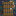

# DungeonZ - Bleak Isles Edition 
**DungeonZ - BLIS** is a fork made by Arona74 from **DungeonZ** mod made by Globox_Z, created for [Conquest of the Bleak Isles Modpack](https://modrinth.com/modpack/bleak-isles) needs.

### What are the differences with original DungeonZ (1.20.1)?
- **Feature: Splitted Mob/Boss modifiers for Health, Damage and Protection, allowing better balancing. DUNGEONS FILES HAVE TO BE EDITED! See example below.**
- **Feature**: Full dungeon structure regeneration, allowing proceduraly generated structure
- **Feature**: Improved multiplayer support on Portal GUI (more settings displayed, waiting player list, you can leave the waiting list and been refunded)
- **Backport**: LevelZ requirement (originaly in DungeonZ 1.21.1)
- **Change**: Dungeon portal blocks are now solid to avoid them been breakable from flowing liquid and solving the multiple triggering when crossing them. Congratulations message when finishing dungeon with a leave link for easy leaving, you can also leave with a right-click on dungeon portal blocks or use the "/dungeon leave" command.
- **Change**: Few fixes on dark dungeon (easier parkour), missing vines in temple dungeon, etc
- **Change**: Fix to avoid fire to break blocks (like vines)
- **Change**: Fix the "flying not allowed" kick on server when teleporting player to dungeon
- **Change**: Fix effects button on dungeon screen
- **Change**: GUI textures build from [Conquest Reforged mod](https://conquestreforged.com/mod) ressources
- **Content**: Temple dungeon made by xeven (originaly in DungeonZ 1.21.1)
- **Content**: French translation made by hirtz-gregoire (originaly in DungeonZ 1.21.1)
- **Content**: [Desert dungeon made by D1scoball](https://www.curseforge.com/minecraft/mc-mods/desert-dungeon-dungeonz-addon)

### What next?
I want to **backport features/fixes** made in last dungeonZ version **to 1.20.1**.

Might **add new features and content in the process**, feel free to participate or just share ideas.

### Support
This fork is given as is, please **don't ask original DungeonZ devs** about issues regarding this fork, **please post in [Issues](https://github.com/Arona74/DungeonZ/issues)**.

### Installation
If you know how to do it, compile yourself from the sources.

Or **download the binaries from [Releases](https://github.com/Arona74/DungeonZ/releases)**.

### Dependencies
Same as DungeonZ:
- Built for [Fabric Loader](https://fabricmc.net/).
- Requires [Fabric API](https://www.curseforge.com/minecraft/mc-mods/fabric-api).
- Requires [Cloth Config API](https://www.curseforge.com/minecraft/mc-mods/cloth-config).

### License
DungeonZ - BIE is licensed under MIT.

### Datapacks - Slighlty different from original DungeonZ
If you don't know how to create a datapack check out [Data Pack Wiki](https://minecraft.fandom.com/wiki/Data_Pack) website and try to create your first one for the vanilla game.
If you know how to create one, the folder path has to be ```data\dungeonz\dungeon\YOURFILE.json```

```json
{
    "dungeon_type": "dark_dungeon", // unique dungeon id, create a lang file in a resource pack "dungeon.unique_id" to have proper translation
    "difficulty": { // set difficulties here, can be any name but have to get translated with a resource pack if you don't use "easy","normal","hard" or "extreme"
        "easy": {
            "mob_health_modificator": 1.0, // modificator to increase mob base health
            "mob_damage_modificator": 1.0, // modificator to increase mob base attack damage
            "mob_protection_modificator": 1.0, // modificator to increase mob base armor
            "loot_table_ids": [ // a list of different loot tables chests and barrels will get filled with
                "dungeonz:chests/dark_dungeon_low_tier_chest_loot",
                "dungeonz:chests/dark_dungeon_mid_tier_chest_loot"
            ],
            "boss_health_modificator": 1.0, // modificator to increase boss base health
            "boss_damage_modificator": 1.0, // modificator to increase boss base attack damage
            "boss_protection_modificator": 1.0, // modificator to increase boss base armor
            "boss_loot_table_id": "dungeonz:chests/dark_dungeon_easy_boss_loot"
        },
        "normal": {
            "mob_health_modificator": 1.5,
            "mob_damage_modificator": 1.5,
            "mob_protection_modificator": 1.5,
            "loot_table_ids": [
                "dungeonz:chests/dark_dungeon_low_tier_chest_loot",
                "dungeonz:chests/dark_dungeon_mid_tier_chest_loot",
                "dungeonz:chests/dark_dungeon_high_tier_chest_loot"
            ],
            "boss_health_modificator": 2.0,
            "boss_damage_modificator": 2.0,
            "boss_protection_modificator": 2.0,
            "boss_loot_table_id": "dungeonz:chests/dark_dungeon_normal_boss_loot"
        }
    },
    "blocks": {
        "minecraft:gold_block": {
            "spawns": [ // a list of entity types which can spawn at the block positions
                "minecraft:skeleton"
            ],
            "chance": { // an object for each difficulty which includes spawn chances at the block positions
                "easy": 0.4,
                "normal": 0.7
            },
            "replace": "minecraft:air"
        },
        "minecraft:iron_block": {
            "spawns": [
                "minecraft:zombie"
            ],
            "chance": {
                "easy": 0.4,
                "normal": 0.7
            },
            "replace": "minecraft:air"
        },
        "minecraft:netherite_block": {
            "boss_entity": "minecraft:warden", // required for one block id! At this block position the boss will spawn
            "data": "", // optional add nbt info to the boss entity
            "replace": "minecraft:air"
        },
        "minecraft:emerald_block": {
            "boss_loot_block": true, // required for one block id! This block will get replaced by a chest filled with the boss loot after completion
            "replace": "minecraft:air"
        },
        "minecraft:quartz_block": {
            "exit_block": true, // required for one block id! Those blocks will get replaced by the dungeon portal to get out from the dungeon after completion
            "replace": "minecraft:stone_bricks"
        }
    },
    "spawner": { // use Dungeon Spawner in your structure build to set the max spawn time for the spawner here before the spawner will automatically break
        "minecraft:zombie": 10,
        "minecraft:skeleton": 5
    },
    "breakable": [], // block ids which can be broken in the dungeon by the player
    "placeable": [ // block ids which can be placed in the dungeon by the player
        "minecraft:torch"
    ],
    "required": { // Items which get consumed after joining the dungeon per difficulty
        "easy": {
            "minecraft:diamond": 1
        },
        "normal": {
            "minecraft:diamond": 5
        },
        "hard": {
            "minecraft:diamond": 10
        }
    },
    "respawn": false, // optional: is respawn allowed?
    "elytra": false, // is Elytra usage allowed?
    "max_group_size": 5,
    "min_group_size": 0, // optional
    "required_level": 0, // optional, levelZ compat
    "cooldown": 108000, // Cooldown after the dungeon is completed or failed in ticks
    "time_limit": 1800, // Optional, Time to complete the dungeon in seconds
    "background_texture": "", // For custom dungeon portal backgrounds, set your texture path here
    "dungeon_structure_pool_id": "dungeonz:dark_dungeon/dungeon_spawn" // Structure part which the dungeon generates start of
}
```

Make sure your first structure piece (`"dungeon_structure_pool_id"`) has a jigsaw block named `dungeonz:spawn`. This is the block where the player will teleport to.

An example part for the overworld structure which leads to the dungeon:

```json
{
    "type": "dungeonz:dimension_structures",
    "start_pool": "dungeonz:overworld_test_start",
    "size": 1,
    "max_distance_from_center": 80,
    "biomes": "#minecraft:is_overworld",
    "step": "surface_structures",
    "start_height": {
        "absolute": 0
    },
    "project_start_to_heightmap": "WORLD_SURFACE_WG",
    "spawn_overrides": {},
    "dungeon_type": "dark_dungeon" // set your unique dungeon id here
}
```

DungeonZ has an extra field called `"dungeon_type"` which has to be one of the defined dungeon types.

### Advancement
DungeonZ provides a advancement criterion trigger called `dungeonz:dungeon_completion`.

```json
    "criteria": {
        "completion_example": {
            "trigger": "dungeonz:dungeon_completion",
            "conditions": {
                "dungeon_type": "dark_dungeon",
                "difficulty": "easy"
            }
        }
    }
```

### Commands
`/dungeon leave`
- Leave the current dungeon (if unable to finish the dungeon)
****
